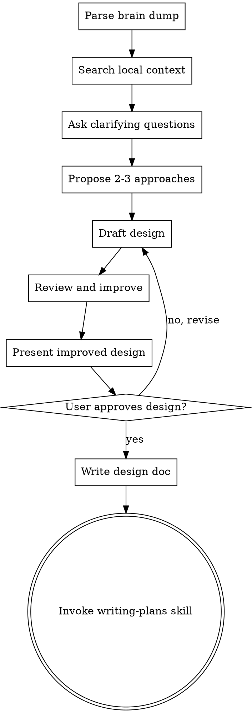

# Scope: From Idea to Validated Design

## Overview

Scope and design implementation work through natural collaborative dialogue. This skill handles the **implementation path** — understanding the problem, challenging assumptions, identifying risks, and converging on a validated design. Ends by chaining to writing-plans.

For decisions, strategy, and advisory conversations, use `/advisory` instead.
For bugs, test failures, and unexpected behavior, use `/systematic-debugging` instead.

Start by parsing the input, understanding the current context, then ask questions one at a time to refine the idea. Once you understand what you're working on, present the design and get user approval.

<HARD-GATE>
Do NOT invoke any implementation skill, write any code, scaffold any project, or take any implementation action until you have presented a design and the user has approved it. This applies to EVERY project regardless of perceived simplicity.
</HARD-GATE>

## Anti-Pattern: "This Is Too Simple To Need A Design"

Every project goes through this process. A todo list, a single-function utility, a config change — all of them. "Simple" projects are where unexamined assumptions cause the most wasted work. The design can be short (a few sentences for truly simple projects), but you MUST present it and get approval.

## Step 0: Altitude Check + Brain Dump Parsing

**Altitude detection (run before parsing):** If the input is at Altitude 0-2 — a life goal ("I want to be known as..."), strategic initiative ("build a product that..."), or broad aspiration — suggest switching to `/decompose` instead. Example: "This sounds like an Altitude 1 goal rather than a specific project to build — want me to run `/decompose` instead? It's better suited for goals this size."

Altitude 3+ (specific project, task cluster, implementation request) → proceed with /scope.

Follow the `intent-extraction` rule for parsing voice-dictated input. Summarize back and confirm before proceeding.

## Step 1: Local Context Search

Before asking questions or doing web research, search [Your Name]'s workspace for relevant context:

| Topic Signal | Where to Search |
|-------------|----------------|
| Existing project/feature | `~/workspace/Code/{project}/` |
| Past research/plans | `~/.claude/plans/`, documents with "Research" or "Plan" in name |
| Past decisions | `~/workspace/Documents/Field-Notes/Decision-Log.md` |
| Current priorities | `~/workspace/Terrain.md` |

### Domain Detection

Detect the domain from the request to load relevant context:

| Path Pattern | Domain | Extra Context to Load |
|-------------|--------|----------------------|
| `.claude/`, `Scripts/`, `container/`, infrastructure keywords | **Jules Infrastructure** | Full system access context. Load `.claude/rules/`, recent cron logs, container config. You have deep knowledge of the entire Jules system. |
| `Code/`, app keywords, user-facing features | **External Product** | User-facing context. Load project CLAUDE.md, test suites, deployment config. Focus on user experience and data safety. |
| `Content-Pipeline/`, `Documents/Content/`, content keywords | **Content** | Load content-marketing skill domain knowledge, voice profile, social strategy. |
| `Documents/`, `Profiles/`, life/business keywords | **Business/Personal** | Load relevant profile docs. Consider routing to /advisory instead. |

Apply heuristics from the request text and any file paths mentioned. When ambiguous, ask.

**Always read**: Today's briefing (`~/workspace/Briefing.md`) for synthesized priorities. If no briefing exists for today, or if this isn't the first session of the day, read `~/workspace/Terrain.md` directly instead.
**Always check**: `~/workspace/Documents/Field-Notes/Decision-Log.md` (has this been decided before?)

Launch parallel Explore subagents (on Haiku for speed/cost) for local and web searches when both are needed.

**Exclude**: `Documents/Archive/`, `.git/`, `node_modules/`, build artifacts

---

### Checklist

1. **Parse brain dump** (Step 0 above)
2. **Search local context** (Step 1 above)
3. **Ask clarifying questions** — one at a time, understand purpose/constraints/success criteria
4. **Propose 2-3 approaches** — with trade-offs and your recommendation
5. **Draft design** — in sections scaled to complexity
6. **Review and improve** — run pre-mortem review on the design, then revise to address findings before presenting
7. **Present improved design** — show the stress-tested design to the user for approval
8. **Write design doc** — save to `~/.claude/plans/YYYY-MM-DD-<topic>-design.md` and commit
9. **Transition to implementation** — invoke writing-plans skill

### Process Flow

**The terminal state is invoking writing-plans.** Do NOT invoke frontend-design, mcp-builder, or any other implementation skill. The ONLY skill you invoke after scope is writing-plans.

### Implementation Process Details

**Understanding the idea:**
- Check out the current project state first (files, docs, recent commits)
- Ask questions one at a time to refine the idea
- Prefer multiple choice questions when possible, but open-ended is fine too
- Only one question per message
- Focus on understanding: purpose, constraints, success criteria

**Exploring approaches:**
- Propose 2-3 different approaches with trade-offs
- Present options conversationally with your recommendation and reasoning
- Lead with your recommended option and explain why

**Drafting the design:**
- Scale each section to its complexity: a few sentences if straightforward, up to 200-300 words if nuanced
- Cover: architecture, components, data flow, error handling, testing

**Reviewing and improving the design (MANDATORY — do not skip):**
Before presenting the design to the user, run a self-review using the four lenses from review-plan:
1. **Failure post-mortem** — What would make this design fail?
2. **Over-engineering post-mortem** — What's unnecessary complexity?
3. **Unstated assumptions** — What are we taking for granted?
4. **Open questions** — What gaps exist?

Then **revise the design** to address critical findings. Simplify over-engineered parts. Make assumptions explicit. Fill gaps. The user should see the improved version, not the first draft.

**Presenting the improved design:**
- Present the stress-tested design to the user for approval
- Ask after each section whether it looks right so far
- Be ready to go back and clarify if something doesn't make sense
- You do NOT need to show the raw review — just present the improved design. Mention briefly what changed: "I stress-tested this and simplified X / made Y explicit / filled in Z."

**After the design:**
- Write the validated design to `~/.claude/plans/YYYY-MM-DD-<topic>-design.md`
- Commit the design document to git
- Invoke the writing-plans skill to create a detailed implementation plan

## Process Visibility

**Announce every step with a bold header.** The user should always know where you are in the process. Use these exact headers:

- **Brain dump parsing** — Step 0
- **Local context search** — Step 1
- **Clarifying question** — Step 2
- **Approaches** — Step 3
- **Draft design** — Step 4
- **Design review** — Step 5
- **Improved design** — Step 6
- **Design doc saved** — Step 7

Each header signals to the user what phase you're in and why. Don't skip headers — even if a step is brief, announce it.

## Key Principles

- **One question at a time** — Don't overwhelm with multiple questions
- **Multiple choice preferred** — Easier to answer than open-ended, especially for voice dictation
- **Later statements win** — When dictation contradicts itself, trust the later statement
- **YAGNI ruthlessly** — Remove unnecessary features from all designs
- **Explore alternatives** — Always propose 2-3 approaches before settling
- **Incremental validation** — Present design/recommendation, get approval before moving on
- **Challenge the frame** — The first question is often not the right question
- **Be flexible** — Go back and clarify when something doesn't make sense
