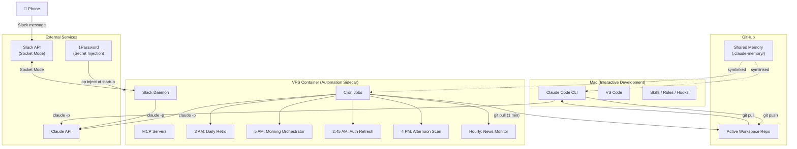

# Jules: A Claude Code Reference Implementation

A reference implementation of a personal AI collaborator built on [Claude Code](https://docs.anthropic.com/en/docs/claude-code). This repo documents the architecture, patterns, and configuration that turns Claude Code from a coding assistant into a full strategic collaborator with autonomous scheduled operations.

**20 skills. 17 rules. 12 hooks. 5 agents. Container infrastructure. 7 scheduled jobs. Slack daemon.**

> **v2.0** adds the container infrastructure, scheduled automation pipeline, Slack daemon, and architecture documentation that were in production but missing from v1.

## What's New in v2

v2 adds the layers that make the system autonomous:

- **Container infrastructure** (`.claude/container/`): Docker setup for the always-on automation sidecar
- **Scheduled automation** (`.claude/scripts/`): Daily retro, morning orchestrator, auth health checks, Slack daemon
- **Architecture documentation** (`docs/architecture.md`): Written overview of the hybrid architecture, credential flow, and job pipeline
- **Evolved skills/rules/hooks**: Slimmer, more focused set reflecting 6+ weeks of production use (35 skills → 20, 24 rules → 17, 9 hooks → 12, 5 agents)
- **System diagram**: Mermaid diagram showing the full hybrid architecture

See [Version History](#version-history) for what changed.

## What This Is

This is a real system, not a tutorial. It runs a solo founder's entire operation: morning briefings, content pipeline, engagement scanning, deployment automation, and strategic decision-making. The AI agent has a defined personality, decision authority framework, and knows when to act autonomously versus when to ask.

This repo contains sanitized versions of the actual configuration files, with personal details replaced by framework templates. The best way to use it: **give Claude Code the URL and ask it to analyze your setup against these patterns.** It'll tell you what's worth adopting and what to skip. See [Getting Started](#getting-started) for the prompt.

## System Overview



## A Day with Jules

The system runs autonomously around the clock, not just during active sessions.

| Time | What Happens |
|------|-------------|
| **Every 1 min** | Container pulls latest code from GitHub |
| **2:45 AM** | Auth health check (validates token before jobs run) |
| **3:00 AM** | Daily retro: parallel agents analyze yesterday's session issues |
| **5:00 AM** | Morning orchestrator: memory synthesis, briefing generation |
| **8 AM-10 PM** | News feed monitor: polls AI reading feeds hourly |
| **Session** | Active collaboration: building, debugging, content, strategy |
| **4:00 PM** | Afternoon scan: context refresh, engagement check |
| **Wrap-up** | Session report, memory updates, commit, self-improvement retro |
| **Anytime** | Slack message from phone → Slack daemon → `claude -p` dispatch |

## Architecture

Six layers, bottom to top. Identity is the foundation. Automation is what makes it autonomous.

### Layer 1: Identity
`Profiles/` — Agent personality, user context, business identity, goals. Loaded into every session.

### Layer 2: Operational State
`Terrain.md`, `Briefing.md`, `Documents/` — Live working state. What's happening now, next, and waiting.

### Layer 3: Configuration
`.claude/settings.json`, `.claude/rules/`, `.claude/skills/`, `.claude/agents/` — Behavioral layer. How the agent works.

### Layer 4: Infrastructure
`.claude/hooks/`, `.claude/container/` — Deterministic layer. Safety guards, Docker setup, entrypoints. Executes the same way every time.

### Layer 5: Automation
`.claude/scripts/` — Scheduled jobs, Slack daemon, background agents. The always-on layer.

### Layer 6: Products
`Code/` — The applications being built. Everything above exists to make this layer ship faster.

For a detailed walkthrough: [`docs/architecture.md`](docs/architecture.md)

## Container Infrastructure

The container is a Debian-based Docker image that runs as an always-on sidecar to your Mac development environment.

**What's inside:**
- Claude Code CLI, Node.js 22, Python 3, git, ripgrep, SSH server
- 1Password CLI for secret injection at startup
- tini as PID 1 (zombie process reaping — critical for `claude -p` workloads)
- Supervisor loop that restarts crashed daemons and hot-reloads on code changes

**Key files:**

| File | Purpose |
|------|---------|
| `Dockerfile` | Multi-stage build: system deps, Node, Python, SSH, Claude CLI, 1Password |
| `docker-compose.yml` | Service definition: ports, volumes, resource limits, security options |
| `docker-entrypoint-root.sh` | Root stage: starts sshd + cron, drops to claude user |
| `entrypoint.sh` | User stage: 8 phases from secret injection to supervisor loop |
| `.env.template` | 1Password vault references (resolved at startup, never real values) |
| `crontab` | Job schedule with secret sourcing pattern |

**Setup:** See the [Getting Started](#getting-started) section. Container setup is optional — the skills, rules, hooks, and agent definitions work without it.

## Scheduled Automation

Six scripts that show distinct architectural patterns:

| Script | Lines | Pattern |
|--------|-------|---------|
| `daily-retro.sh` | ~540 | Parallel `claude -p` agents + per-issue synthesis + signal file output |
| `morning-orchestrator.sh` | ~200 (excerpt) | Multi-phase orchestrator with parallel dispatch and phase coordination |
| `auth-refresh.sh` | ~90 | Proactive auth health monitoring with Slack alerting |
| `git-auto-pull.sh` | ~60 | Fast-forward pull with divergence detection |
| `slack-daemon/index.js` | ~850 | Socket Mode Slack → complexity heuristic → `claude -p` dispatch |

The daily retro is the flagship: it parses session issues into individual files, runs analysis agents in parallel (each iterating at its own pace), synthesizes per-issue, and assembles a report. The morning orchestrator reads the retro's signal file and incorporates it into the daily briefing.

## Getting Started

The fastest way to learn from this repo is to point Claude Code at it and ask for recommendations tailored to your project.

### The One-Prompt Approach

Open Claude Code in your project directory and paste this:

```
Analyze my current Claude Code setup (CLAUDE.md, .claude/ directory, and codebase) and
compare it against the reference implementation at https://github.com/jonathanmalkin/jules.

1. Read my existing configuration and understand my project, workflow, and goals.
2. Fetch and study the Jules repo README, CLAUDE.md, profiles/, .claude/rules/,
   .claude/hooks/, .claude/skills/, .claude/agents/, .claude/container/,
   .claude/scripts/, and docs/architecture.md to understand the patterns.
3. Identify the highest-impact improvements I could make, prioritized by:
   - What I'm missing entirely (e.g., no safety hooks, no decision framework)
   - What I have but could strengthen (e.g., thin CLAUDE.md, no agent personality)
   - What's in Jules that doesn't apply to my situation (skip these)
4. Give me a concrete, prioritized action plan. Start with 2-3 changes I can make today.

Don't try to replicate the whole system. Tell me what would actually help MY setup.
```

### Manual Setup

If you prefer to browse and borrow directly:

1. Fork this repo
2. Copy the `.claude/` directory structure into your project
3. Edit `CLAUDE.md` with your agent's identity and your working style
4. Fill in the profile templates in `profiles/`
5. Start with 2-3 skills and expand based on what you actually need
6. Add rules as patterns emerge across sessions
7. Add hooks for safety and automation only when the probabilistic version isn't reliable enough
8. **Optional:** Set up the container for scheduled automation (`.claude/container/`)

Start small. The system grew organically over weeks of daily use. Don't try to build the whole thing on day one.

## Workflow

Every interaction follows this pipeline. Messy voice input goes in, shipped results come out.

```
┌───────────────────────────────────────────┐
│  🎙️ Voice · 🔍 Intent · 📋 Classify      │
│       Quick · Debug · Advisory · Scope    │
└────────────────────┬──────────────────────┘
                     │
         ┌───────────┴───────────┐
         ▼                       ▼
┌─────────────────┐   ┌─────────────────┐
│  💡 Advisory     │   │  🏗️ Code         │
│                  │   │                  │
│  Steelman        │   │  Plan · Review   │
│  Pre-mortem      │   │  Build · Test    │
│  Reversibility   │   │                  │
│  Bias scan       │   │                  │
│       │          │   │       │          │
│       ▼          │   │       ▼          │
│  ✅ Execute      │   │  🚀 Ship         │
│ Approve / Reject │   │ Dev / Staging    │
│     / Discuss    │   │   / Production   │
└────────┬─────────┘   └────────┬─────────┘
         │                      │
         └──────────┬───────────┘
                    ▼
      ┌──────────────────────────┐
      │  🔄 Wrap-up               │
      │  Session report           │
      │  Memory updates · Commit  │
      │  Self-improvement retro   │
      └──────────────────────────┘
```

## Directory Structure

```
.claude/
  settings.json        # Hook wiring, permissions, env vars, effort level
  container/           # Docker infrastructure (Dockerfile, compose, entrypoint, crontab)
  scripts/             # Scheduled automation (retro, orchestrator, Slack daemon)
  skills/              # 20 custom skill definitions
  rules/               # 17 behavioral rules
  hooks/               # 12 automation hooks
  agents/              # 5 specialized subagent definitions

docs/
  architecture.md      # Detailed architecture overview

profiles/              # Agent and user profile templates + examples
Documents/
  Content-Pipeline/    # Content workflow (queue, ideas, drafts, published)
  Engagement/          # Engagement scanning (reply queue, feedback)
  Field-Notes/         # Session retros, decision log, briefing archives
CLAUDE.md              # The master configuration (always-loaded context)
Terrain.md             # Operational state template
Briefing.md            # Daily briefing template (generated by morning orchestrator)
```

## What's Included

### Skills (20)

| Skill | What It Does |
|-------|-------------|
| `advisory` | Thinking partner for decisions, strategy, and research. Steelmans alternatives, runs pre-mortems. |
| `agent-browser` | Browser automation library. Authentication, session management, form filling, navigation. |
| `check-updates` | Display the latest Claude Code change monitor report. |
| `content-marketing` | Content pipeline domain knowledge. Brand voice, content tracks, platform formatting. |
| `copy-for` | Format text for a target platform (Discord, Reddit, LinkedIn, X) and copy to clipboard. |
| `diagram` | Generate and iterate on Mermaid diagrams with live preview. |
| `executing-plans` | Execute a written implementation plan with human review between batches. |
| `generate-image-openai` | Generate images using OpenAI/DALL-E models via MCP server. |
| `good-morning` | Autonomous morning briefing. Synthesizes analytics, blockers, content, decisions. |
| `long-form-publish` | Multi-platform content publishing for long-form articles. |
| `post-article` | Post a queued article to Reddit and X. Cross-platform publishing flow. |
| `retro-deep` | Deep retrospective. Forensic analysis of session issues. Auto-applies fixes. |
| `review-plan` | Auto-tiered review for plans and architecture decisions. |
| `scope` | Scope and design implementation work before building. |
| `scout` | Scout for Claude Code technical insights and engagement opportunities. |
| `skill-creator` | Meta-skill for creating new skills with proper conventions. |
| `subagent-driven-development` | Fast autonomous plan execution with two-stage review. |
| `systematic-debugging` | Structured debugging methodology. Hypothesize, test, narrow. |
| `user-testing` | Persona-driven UX evaluation with 8 evaluation lenses. |
| `wrap-up` | End-of-session checklist. Commits, memory, state, session reports. |

**Also available:** Writing-plans, executing-plans, scout-techniques, system-health, and more. Plus Anthropic's built-in skills (docx, pptx, xlsx, pdf) and plugins (skill-creator, LSP servers).

### Rules (17)

| Rule | Purpose |
|------|---------|
| `bash-prohibited-commands` | Commands blocked by safety hooks and their substitutes |
| `claude-cli-scripting` | Patterns for scripting Claude Code in CI, hooks, and automation |
| `credential-lookup` | Deterministic credential resolution order (env vars → 1Password) |
| `cron-status` | How to check container cron jobs, logs, and daemon health |
| `docker-container` | Container rebuild rules, auth patterns, crash-loop recovery |
| `dotfiles` | Conventions for managing dotfiles and shell configuration |
| `editing-claude-config` | Safe patterns for editing Claude Code configuration files |
| `env-vars-config` | Environment variable reference (active, evaluated, architecture) |
| `intent-extraction` | Parse messy voice-dictated input correctly |
| `investigation-budget` | Stop investigating when you can present options |
| `mcp-servers` | MCP server management conventions |
| `plan-review-docs` | Standards for plan documents (structure, completeness, review) |
| `proactive-research` | Research instead of deflecting ("check the docs") |
| `research-phase` | Auto-dispatch research agents before skills |
| `terrain-editing` | Conventions for updating operational state |
| `token-efficiency` | Compress bash output, select appropriate models for subagents |

### Hooks (12)

| Hook | Trigger | What It Does |
|------|---------|-------------|
| `bash-safety-guard.sh` | PreToolUse: Bash, Read | Blocks dangerous commands (rm, sudo, force-push, credentials, pipe-to-shell) |
| `bash-compress-hook.sh` | PreToolUse: Bash | Compresses verbose output (npm, git, docker) to save context |
| `pre-commit-verify.sh` | PreToolUse: Bash | Validates commits have proper messages and staged files |
| `clipboard-validate.sh` | PostToolUse: Bash, Write, Edit | Validates and auto-copies generated content to clipboard |
| `pre-compact-save.sh` | PreCompact | Saves context before automatic compaction |
| `notify-input.sh` | Notification | Plays a sound when the agent needs user input |
| `cloud-bootstrap.sh` | SessionStart | Bootstraps environment for cloud/remote sessions |
| `inject-datetime.sh` | UserPromptSubmit | Injects current date/time into every prompt |
| `inject-environment.sh` | SessionStart | Injects environment context (Mac vs container) |
| `slack-log-hook.sh` | PostToolUse: all | Logs tool calls to Slack for mobile monitoring |
| `plan-review-enforcer.sh` | PostToolUse: Write, Edit | Enforces plan review before implementation changes |
| `plan-review-gate.sh` | PreToolUse: ExitPlanMode | Gates execution on plan approval status |

### Agents (5)

| Agent | Model | Purpose |
|-------|-------|---------|
| `security-reviewer` | Sonnet | Reviews code changes for vulnerabilities, data leakage, privacy violations |
| `explore` | Haiku | Fast read-only codebase exploration with pre-computed index |
| `codex-review` | Haiku | External code review via OpenAI Codex CLI |
| `app-tester` | Sonnet | Automated test suite runner. Knows the full testing matrix. |
| `content-marketing` | Haiku | Read-only content tasks. Backlog, inventory, calendar, monitoring. |

## Key Design Decisions

**Identity persistence over memory.** Memory is lossy. Context windows reset. The CLAUDE.md hierarchy loads identity, decision rules, and behavioral patterns into every session. The agent doesn't need to remember who it is — it's told every time.

**Deterministic over probabilistic.** When a pattern works, codify it into a script. Skills and rules are probabilistic (the LLM might follow them). Hooks and scripts are deterministic (they execute the same way every time). Push behavior toward determinism whenever possible.

**Hybrid architecture.** Mac for interactive development, container for always-on automation. Memory synced via git. Neither environment is complete alone — together they form a 24/7 system.

**Signal files for job coordination.** The daily retro and morning orchestrator communicate via signal files rather than direct invocation. Either can run independently, retry without affecting the other, and the orchestrator gracefully handles a missing or failed retro.

**Explicit autonomy boundaries.** No ambiguity about what the agent can do on its own. The "Just Do It / Ask First" framework with standing orders eliminates the gray zone that makes autonomous agents unreliable.

**Minimal engineering.** Leverage Claude Code's built-in features (plan mode, auto memory, skills, rules) before building custom infrastructure. Don't build what a config option handles.

## Version History

| Version | Date | What Changed |
|---------|------|-------------|
| [v2.0](https://github.com/jonathanmalkin/jules/releases/tag/v2.0) | Mar 2026 | Container infrastructure, scheduled automation, Slack daemon, architecture docs, evolved skills/rules/hooks |
| [v1.0](https://github.com/jonathanmalkin/jules/releases/tag/v1.0) | Mar 2026 | Initial release: skills, rules, hooks, agents, profile templates |

## Acknowledgments

Five skills in this system were adapted from [Superpowers](https://github.com/obra/superpowers) by Jesse Vincent (MIT License): `scope`, `writing-plans`, `executing-plans`, `subagent-driven-development`, and `systematic-debugging`. Each has been heavily customized but the core methodologies originate from that project.

## License

MIT. Use it, adapt it, build on it.
