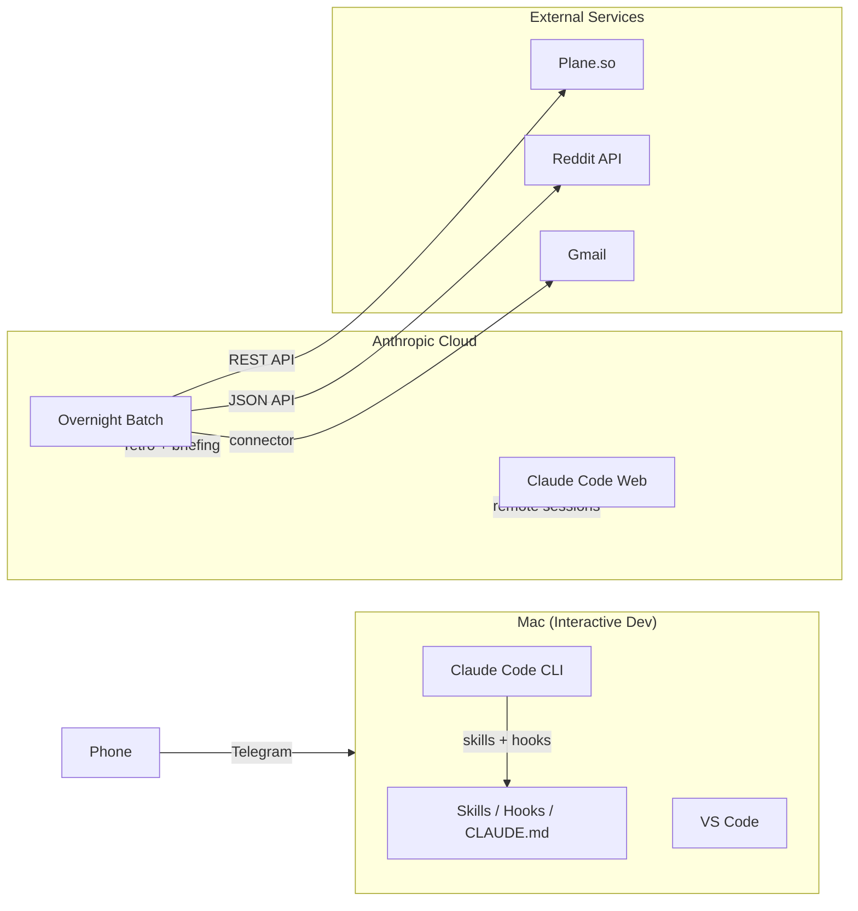

# Jules: A Claude Code Reference Implementation

A reference implementation of a personal AI collaborator built on [Claude Code](https://docs.anthropic.com/en/docs/claude-code). This repo documents the architecture, patterns, and configuration that turns Claude Code from a coding assistant into a full strategic collaborator with autonomous scheduled operations.

**17 skills. 5 hooks. Cloud scheduled batch. Telegram access. RTK token optimization.**

> **v4.0** simplifies everything. 32 skills became 17. 15 hooks became 5. The VPS, Docker container, and Slack daemon are gone — replaced by Anthropic Cloud scheduled tasks and Telegram. Same capabilities, half the complexity.

## What's New in v4

v4 is a simplification release. The system got more powerful by getting smaller:

- **Consolidated skills**: `/think` replaces decompose + advisory. `/build` replaces scope + writing-plans + executing-plans + subagent-driven-development. `/write` replaces write-article. 32 skills to 17.
- **Unified safety hook**: 6 hook scripts + 4 subscripts consolidated into 1 `safety-guard.sh` covering command blocking, secret scanning, financial data guard, and domain blocking. 15 hooks to 5.
- **Rules absorbed into CLAUDE.md**: 20+ rule files became behavioral guidance sections in CLAUDE.md. Under 500 lines. One file, always loaded.
- **VPS eliminated**: 9 cron jobs, Docker container, Slack daemon, auth infrastructure — all gone. Replaced by one Cloud scheduled batch task.
- **Cloud batch**: Overnight sequential task (retro + memory, morning briefing, email fetch) runs on Anthropic Cloud. Calls APIs directly via HTTP.
- **Telegram access**: Interactive messaging when laptop is open. Replaces 24/7 Slack daemon.
- **RTK hook**: Rust Token Killer rewrites bash commands for 60-90% token savings. Subsumes the old bash-compress-hook.

<details>
<summary>What changed in v3</summary>

v3 added planning and research infrastructure:

- **Goal decomposition**: Socratic dialogue for breaking down goals into executable scope
- **Planning dispatch**: Triage and dispatch work. Batched decision cards, autonomous task queue
- **Deep research**: Parallel Haiku agents gather evidence, Sonnet synthesizes
- **Security hooks**: Sensitive outbound guard, session tracker, domain blocking
- **Context reload**: Deterministic reload after /clear

</details>

<details>
<summary>What changed in v2</summary>

v2 added container infrastructure and automation:

- **Container infrastructure**: Docker setup for an always-on automation sidecar
- **Scheduled automation**: Daily retro, morning orchestrator, auth checks, Slack daemon
- **Architecture documentation**: Hybrid architecture overview

</details>

## What This Is

This is a real system, not a tutorial. It runs a solo founder's entire operation: morning briefings, content pipeline, engagement scanning, deployment automation, and strategic decision-making. The AI agent has a defined personality, decision authority framework, and knows when to act autonomously versus when to ask.

This repo contains sanitized versions of the actual configuration files, with personal details replaced by framework templates. The best way to use it: **give Claude Code the URL and ask it to analyze your setup against these patterns.** It'll tell you what's worth adopting and what to skip. See [Getting Started](#getting-started) for the prompt.

## System Overview



## A Day with Jules

| Time | What Happens |
|------|-------------|
| **Session start** | Hook pulls latest code from GitHub |
| **Sessions** | Active collaboration: building, debugging, content, strategy. Skills route requests, hooks guard every tool call. |
| **Anytime** | Telegram from phone when laptop is open. Cloud web sessions when laptop is closed. |
| **Overnight** | Cloud batch: retro + memory analysis, morning briefing assembly, email fetch. Ready before the laptop opens. |
| **Wrap-up** | Session report, commit, quality checks, flag publishable content. |

## Architecture

Five layers, bottom to top. Identity is the foundation. Products are what get shipped.

### Layer 1: Identity
`profiles/` — Agent personality, user context, business identity, goals. Loaded into every session.

### Layer 2: Operational State
`Terrain.md`, `Briefing.md`, `Documents/` — Live working state. What's happening now, next, and waiting.

### Layer 3: Configuration
`CLAUDE.md` — Behavioral layer. Routing, decision authority, standing orders, absorbed rules. One file, always loaded. Skills and hooks in `.claude/`.

### Layer 4: Automation
Cloud scheduled batch — Overnight retro, morning briefing, email fetch. Session-start hook for git sync.

### Layer 5: Products
`Code/` — The applications being built. Everything above exists to make this layer ship faster.

For a detailed walkthrough: [`docs/architecture.md`](docs/architecture.md)

## Getting Started

The fastest way to learn from this repo is to point Claude Code at it and ask for recommendations tailored to your project.

### The One-Prompt Approach

Open Claude Code in your project directory and paste this:

```
Analyze my current Claude Code setup (CLAUDE.md, .claude/ directory, and codebase) and
compare it against the reference implementation at https://github.com/jonathanmalkin/jules.

1. Read my existing configuration and understand my project, workflow, and goals.
2. Fetch and study the Jules repo README, CLAUDE.md, profiles/, .claude/hooks/,
   .claude/skills/, and docs/architecture.md to understand the patterns.
3. Identify the highest-impact improvements I could make, prioritized by:
   - What I'm missing entirely (e.g., no safety hooks, no decision framework)
   - What I have but could strengthen (e.g., thin CLAUDE.md, no agent personality)
   - What's in Jules that doesn't apply to my situation (skip these)
4. Give me a concrete, prioritized action plan. Start with 2-3 changes I can make today.

Don't try to replicate the whole system. Tell me what would actually help MY setup.
```

### Manual Setup

If you prefer to browse and borrow directly:

1. Fork this repo
2. Copy the `.claude/` directory structure into your project
3. Edit `CLAUDE.md` with your agent's identity and your working style
4. Fill in the profile templates in `profiles/`
5. Start with 2-3 skills and expand based on what you actually need
6. Add hooks for safety only when the probabilistic version isn't reliable enough

Start small. The system grew organically over weeks of daily use. Don't try to build the whole thing on day one.

## Workflow

Every interaction follows this pipeline. Messy voice input goes in, shipped results come out.

```
                 Input
                   |
         +--------+--------+
         v                  v
   Think / Research      Build / Write
         |                  |
    Advisory            Plan > Execute
    Decompose           Test > Ship
         |                  |
         +--------+---------+
                  v
             Wrap-up
     Commit . Report . Ship
```

## Directory Structure

```
.claude/
  settings.json        # Hook wiring, permissions, env vars
  skills/              # 17 custom skill definitions
  hooks/               # 5 automation hooks
  agents/              # Specialized subagent definitions

docs/
  architecture.md      # Detailed architecture overview

profiles/              # Agent and user profile templates + examples
Documents/
  Content-Pipeline/    # Content workflow (queue, ideas, drafts, published)
  Engagement/          # Engagement scanning (reply queue, feedback)
  Field-Notes/         # Session retros, decision log, briefing archives
CLAUDE.md              # The master configuration (always-loaded context)
Terrain.md             # Operational state template
Briefing.md            # Daily briefing template (generated by overnight batch)
```

## What's Included

### Skills (17)

| Skill | What It Does |
|-------|-------------|
| `think` | Recursive decomposition + advisory. Altitude system for goals, adversarial review for decisions. |
| `build` | Software dev end-to-end: scope, plan, execute, deploy. |
| `write` | Content production: seed to platform-ready output across all channels. |
| `research` | Standalone research with persistence and cross-session pickup. Living documents. |
| `debug` | Systematic debugging: hypothesize, test, narrow. |
| `replies` | Check X mentions, draft replies, post approved ones. |
| `good-morning` | Interactive walkthrough of the morning briefing (10 sections). |
| `wrap-up` | End-of-session: issue capture, report, ship. 3 phases. |
| `stop-slop` | Structural audit for AI writing patterns. |
| `pdf` | PDF operations. |
| `plane` | Plane.so interface: MCP tools + gap scripts + reconciliation. |
| `send-email` | Send email via Resend. |
| `financial-advisor` | Personal finance planning. |
| `generate-image-openai` | Image generation with iterative two-phase workflow. |
| `search-history` | Search session documents. |
| `skill-creator` | Create and modify skills. |
| `agent-browser` | Browser automation. |

### Hooks (5)

| Hook | Trigger | What It Does |
|------|---------|-------------|
| `safety-guard.sh` | PreToolUse: Bash, WebFetch, Write, Edit | Unified security: command blocking, secret scanning, financial data guard, domain blocking |
| `notify-input.sh` | PostToolUse | Desktop notification when agent needs input |
| `rtk-rewrite.sh` | PreToolUse: Bash | RTK token optimization rewrites (60-90% savings on dev operations) |
| `session-start.sh` | SessionStart | Git pull on session open |

**Also available:** Anthropic's built-in skills (docx, pptx, xlsx, pdf) and plugins.

### Cloud Scheduled Batch

One overnight task, three sequential phases:

| Phase | What It Does |
|-------|-------------|
| Retro + Memory | Analyze recent sessions, propose CLAUDE.md changes, prune stale items |
| Morning Briefing | Assemble 10-section briefing from Plane, Reddit, Gmail, git log, retro output |
| Email Fetch | Pull and categorize inbox |

## Key Design Decisions

**Identity persistence over memory.** Memory is lossy. Context windows reset. The CLAUDE.md hierarchy loads identity, decision rules, and behavioral patterns into every session. The agent doesn't need to remember who it is — it's told every time.

**Deterministic over probabilistic.** When a pattern works, codify it into a script. Skills are probabilistic (the LLM might follow them). Hooks and scripts are deterministic (they execute the same way every time). Push behavior toward determinism whenever possible.

**Simple over complex.** The v3 to v4 transition proved this. 15 hooks doing 15 things became 1 hook doing the same 15 things. 20 rules files became CLAUDE.md sections. A Docker container with 9 cron jobs became one Cloud scheduled task. Same capabilities, half the maintenance.

**Explicit autonomy boundaries.** No ambiguity about what the agent can do on its own. The "Just Do It / Ask First" framework with standing orders eliminates the gray zone that makes autonomous agents unreliable.

**Minimal engineering.** Leverage Claude Code's built-in features (plan mode, skills, hooks) before building custom infrastructure. Don't build what a config option handles. Before adding something new: can an existing feature handle this?

## Version History

| Version | Date | What Changed |
|---------|------|-------------|
| v4.0 | Mar 2026 | Simplification: 32 to 17 skills, 15 to 5 hooks, rules absorbed into CLAUDE.md, VPS/Docker eliminated, Cloud batch, Telegram, RTK |
| [v3.0](https://github.com/jonathanmalkin/jules/releases/tag/v3.0) | Mar 2026 | Planning infrastructure, deep research, security hooks, dispatch conventions |
| [v2.0](https://github.com/jonathanmalkin/jules/releases/tag/v2.0) | Mar 2026 | Container infrastructure, scheduled automation, Slack daemon, architecture docs |
| [v1.0](https://github.com/jonathanmalkin/jules/releases/tag/v1.0) | Mar 2026 | Initial release: skills, rules, hooks, agents, profile templates |

## Acknowledgments

Five skills in this system were adapted from [Superpowers](https://github.com/obra/superpowers) by Jesse Vincent (MIT License): `scope`, `writing-plans`, `executing-plans`, `subagent-driven-development`, and `systematic-debugging`. Each has been heavily customized and consolidated (all four are now part of `/build`) but the core methodologies originate from that project.

## License

MIT. Use it, adapt it, build on it.
